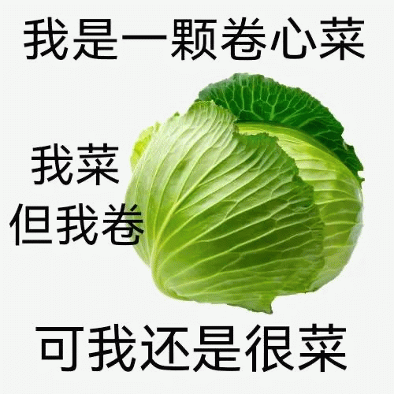

[ [English](README.md) | [繁體中文](README_zh.md) ]  

# 🌱 歡迎來到 **NLP-cabbage**！🥬  

大家好！👋  
我們是畢業於 **國立中興大學 113級電機資訊學院學士班 (EECS第一屆！)** 的同學們。2024 年畢業後，我們各自在不同學校就讀碩士，因為對 NLP 的共同愛好，便成立了這個組織！💡  

**NLP-cabbage** 是我們用來交流知識、分享想法的 NLP 交流組織。😊  

---

## 🚀 我們的活動
- 🧱 分享資源、心得與筆記。  
- 🧪 合作或分享各自在進行的 Project。  
- 🗨️ 討論最新研究、工具和趨勢，並交流我們的想法。  

---

## 🌟 未來目標
隨著我們的進步，我們希望：  
- 製作一些專案並開源。  
- 提升我們在 NLP 領域的能力，並培養一同協作的經驗。  

🎉 一起學習、創造、成長！  

---

## 🥬 Why Cabbage?
Cabbage 來自以下迷因:  
